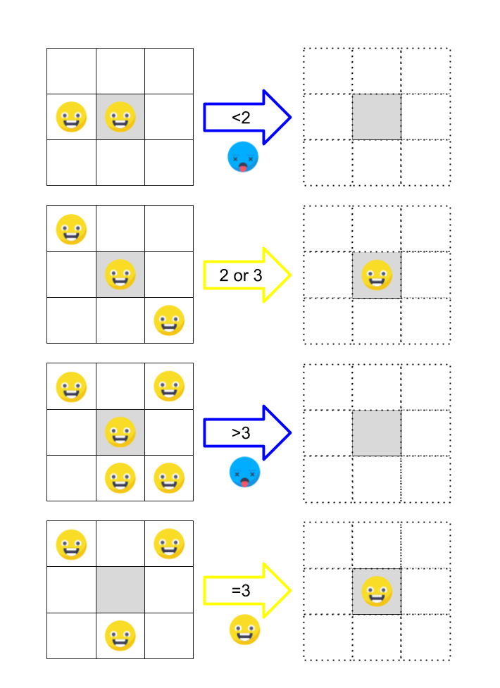

# GameShould of life - Java

## How use this repo
I recommend to you create a new branch in each try of do the game.

Enjoy it.

## Rules:
<section>
    
    
</section>

## More information:

[Code Retreat - Game of life](https://www.coderetreat.org/pages/facilitating/gol/)

[Wikipedia - Game of life](https://en.wikipedia.org/wiki/Conway%27s_Game_of_Life)

